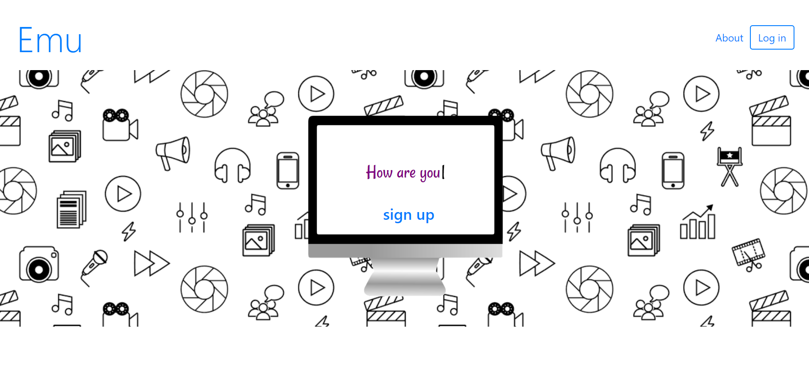
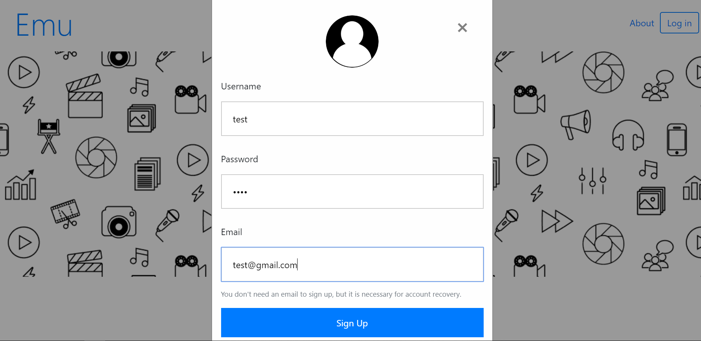
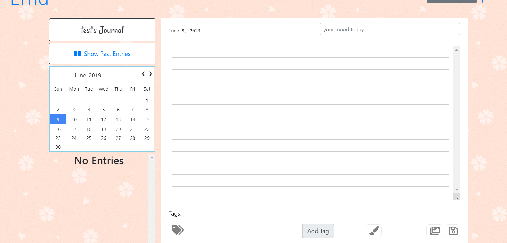
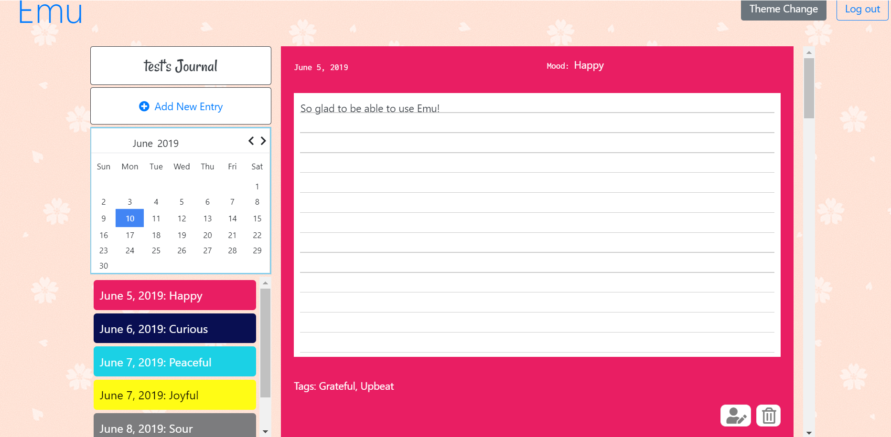
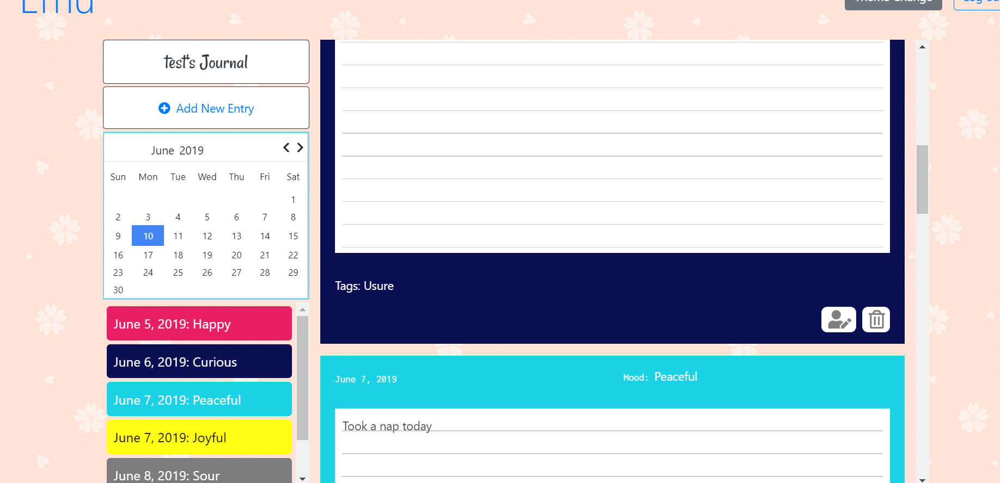

# Emu

Emu (Emotional mood understanding) is a micro-logging site that focuses on moods, creating an emotive snapshot of the day. Tracking emotions leads to increased Emotional Intelligence and enhanced mental health.  

* Users sign-up with a name, email and password.

* They create daily entries with a general mood descriptor, diary content, tag words and color label.

* Daily entries are kept in a database associated with the User Id. They can be accessed on a past entries page. From this page, entries can be updated and deleted.

Check it out on Heroku: https://emu-journal.herokuapp.com

## Getting Started

This app was built using React JS and MongoDB for database management:

    "@simonwep/pickr": "^0.6.2",
    "axios": "^0.19.0",
    "bcrypt": "^3.0.6",
    "cors": "^2.8.5",
    "dotenv": "^8.0.0",
    "express": "^4.16.3",
    "moment": "^2.24.    
    "mongoose": "^5.3.16",0",
    "react": "^16.8.6",
    "react-dom": "^16.8.6",
    "react-moment": "^0.9.2",
    "react-router-dom": "^5.0.0",
    "react-router-hash-link": "^1.2.1",
    "react-scripts": "3.0.1",
    "react-simple-popover": "^0.2.4",
    "react-typing-animation": "^1.6.2",
    "reactstrap": "^8.0.0"

## Overview

### Sign-Up/Login

Users provide username, email and password to create account. This information is storedin database.

### Entry Page

A New Entry consists of a general mood descriptor, diary content, tag words and color label.

The mood color is attached to the background color of the Entry. All of this information is saved to the database. A "mini-history" allows users to see a brief summary of past entries in the sidebar. Clicking on one of these directs to a more comprehensive past history.

### Past Entries Page

The Past Entries page gives a full summary of all posts and their content. From here, a user can update or delete an Entry.

### Development Issues
  * Calendar is not currently working -- will log mood color for each day
  * Additional creative expression
    - Use emojis to express feelings
    - Upload pictures to entry

## Authors
  * Teamu
    - Ann MacMillan
    - Kira Williams
    - Jennifer Ginelli

## Acknowledgments
   * This code is forked from (heroku-cra-node)[https://github.com/mars/heroku-cra-node] to deploy to heroku.
